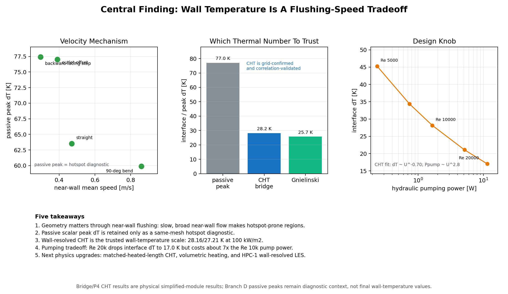

# Central Finding One-Pager

Date: 2026-06-20

Roadmap item: AO

Purpose: one read-first page summarizing the project.

## Central Finding

In the simplified module, the useful design idea is not "bends are hot." It is:

> Wall-temperature risk follows near-wall flushing. Slow, broad near-wall flow creates hotspot-prone regions; faster flushing reduces wall/interface superheat, but the hydraulic pumping cost rises steeply.

## Figure

Generated by:

- `scripts/build_central_finding_onepager_ao.py`
- `results/branch_d/central_finding_onepager_ao.png`
- `results/report_figures/35_central_finding_onepager.png`

## Five Takeaways

1. Geometry matters through near-wall flushing: the outlet-offset and BFS cases create slow near-wall flow and are hotspot-prone; the 90-degree bend is not automatically hot.
2. Passive scalar peak dT is retained only as a same-mesh hotspot diagnostic. It should not be reported as a physical wall-temperature prediction.
3. Wall-resolved CHT is the trusted wall-temperature scale: `27-28 K` interface superheat at `100 kW/m^2`, two meshes `3.4%` apart, and Dittus-Boelter/Gnielinski agreement within about `6-10%`.
4. Pumping tradeoff is the design knob: at `100 kW/m^2`, the AN sweep drops interface dT from `28.16 K` at `Re = 10,000` to `17.03 K` at `Re = 20,000`, while simplified-module hydraulic pumping power rises from about `1.646 W` to `11.466 W`.
5. The next physics upgrades are matched-heated-length or blanket-scale CHT, volumetric heating, and HPC-1 wall-resolved LES. The P4 geometry CHT table and AN velocity sweep are already closed for the simplified-module mechanism claim.

## Report-Safe Wording

Use:

> The controlled geometry sequence suggests that near-wall flushing controls where hotspot diagnostics appear. The physical wall-temperature scale is now the wall-resolved CHT bridge value, `27-28 K` at `100 kW/m^2`, not the passive peak. The wall-resolved CHT sweep gives `dT ~ U^-0.70`, while faster flow increases hydraulic pumping power approximately as `U^2.8`.

Avoid:

> The project has a validated stellarator blanket wall-temperature law.

## Caveats

- The four-geometry velocity/peak trend is still `n = 4` and passive-scalar peak based.
- The CHT bridge is straight-channel; the P4 straight/BFS/outlet-offset geometry CHT comparison is complete, but it is not a blanket-scale optimization ranking.
- The AP pumping curve is hydraulic `dP*Q` only; it does not include pump efficiency, manifold losses, or plant-level pumping cost.
- v26/v27 remain illustrative coarse LES/thermal LES diagnostics, not validated production LES.
