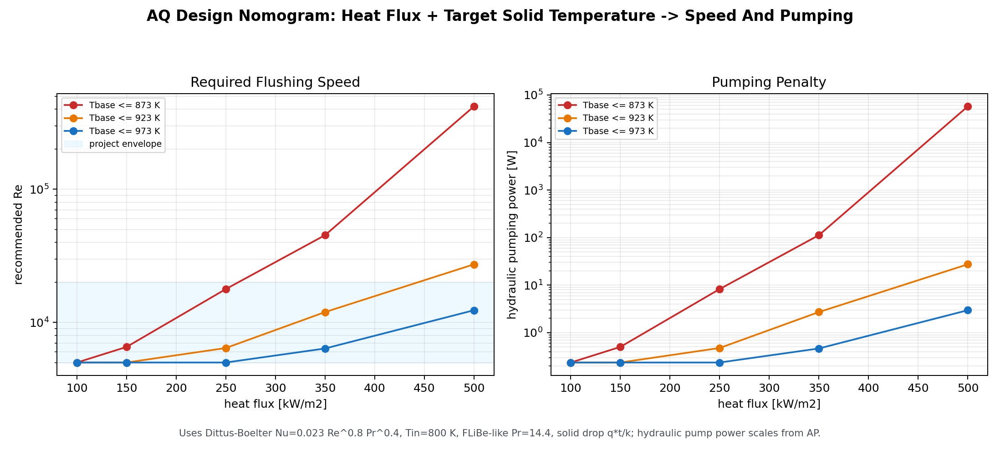

# Design Nomogram / Calculator

Date: 2026-06-20

Roadmap item: AQ

Purpose: turn the CHT/correlation law into a simple sizing tool: given heat flux and target maximum solid-base temperature, estimate the required flushing speed and hydraulic pumping penalty.

## Formula

This calculator uses the requested Dittus-Boelter form:

```text
Nu = 0.023 Re^0.8 Pr^0.4
film dT = q'' * Dh / (Nu * k_fluid)
solid drop = q'' * t_solid / k_solid
Tbase = Tin + film dT + solid drop
```

Constants used:

- `Tin = 800 K`
- `Pr = 14.4`
- `Dh = 0.02667 m`
- `k_fluid = 1.0 W/m/K`
- `solid thickness = 0.004 m`
- `k_solid = 30 W/m/K`
- project envelope: `Re = 5,000-20,000`
- hydraulic pumping power scales from AP as `P_pump = 1.6464 W * (Re/10000)^2.8`

## Generated Artifacts

- `scripts/build_design_nomogram_aq.py`
- `results/branch_d/design_nomogram_aq.csv`
- `results/branch_d/design_nomogram_aq.png`
- `results/report_figures/36_design_nomogram.png`

## Figure



## Key Readout

For a strict `873 K` solid-base target:

| Heat Flux | Required / Recommended Re | Pump Power | Status |
|---:|---:|---:|---|
| `100 kW/m^2` | raw `3400`, use `5000` minimum | `0.236 W` | below envelope; Re 5000 is conservative |
| `150 kW/m^2` | `6546` | `0.503 W` | inside envelope |
| `250 kW/m^2` | `17807` | `8.282 W` | inside envelope but expensive |
| `350 kW/m^2` | `45252` | `112.805 W` | outside project envelope |
| `500 kW/m^2` | `419623` | `57615.960 W` | outside envelope; redesign required |

For a relaxed `923 K` target, `350 kW/m^2` is inside the envelope at `Re = 11964`, but `500 kW/m^2` still needs `Re = 27318`, above the current project envelope.

For a relaxed `973 K` target, `500 kW/m^2` comes back inside the envelope at `Re = 12347`, with estimated hydraulic pumping power about `2.971 W`; however, this temperature is above the conservative `873 K` RAFM/Pint guide used in AI, so it is not a safe material claim.

## Interpretation

The calculator makes the design tradeoff blunt:

- Low heat flux (`100-150 kW/m^2`) is easy for the bridge model under an `873 K` solid-base cap.
- Moderate heat flux (`250 kW/m^2`) can still fit the `873 K` cap, but it costs a large pumping increase.
- Higher heat flux (`350-500 kW/m^2`) needs either a relaxed temperature target, redesigned channel geometry, more heat-transfer enhancement, a different material limit, or a different physics model.

## Caveats

- This is a calculator/nomogram, not a new CFD run.
- Dittus-Boelter is a straight-channel turbulent correlation; it is useful for first sizing, not for validating the separated Branch D geometries.
- The completed AN bridge sweep fits `dT ~ U^-0.7047`, shallower than Dittus-Boelter. This AQ nomogram intentionally keeps the requested textbook formula; a future project-specific calculator can swap in the AN fit.
- Pumping power is hydraulic `dP*Q` for the simplified module and does not include pump efficiency, manifolds, or plant-level losses.
- Results outside `Re = 5,000-20,000` are explicitly outside the current project envelope.
- The target temperature here is the heated solid base. If the target is instead the coolant-facing interface, remove the solid-drop term before solving.
