# Thermal-Hydraulic Feasibility Study Of A Simplified Stellarator-Relevant Cooling Module

Draft version: v0  
Status: primary integrated report draft, not final submission text

## Citation Note

Citation placeholders in this draft use source names or source-note filenames. Before submission, convert them to final citation style using `references/references.bib` and `docs/report_references_draft.md`. Q full-text sources are now local; remaining metadata-only sources should still be identified as metadata-only.

## Section-To-Spine Map

| Report section | Canonical spine / task coverage |
|---|---|
| Abstract, Introduction | V/T15, A-Z guardrail |
| Literature Review | K/N, T9-T11 |
| Model Definition | A-C, F/H, T14 |
| Numerical Methods | B-C/F/L-M, T18-T19 |
| Results | D-I, AN/AO/AP/AQ/AW, P4 |
| Uncertainty And Limitations | R/U/X, T13/T17 |
| Future Work | P-S, T22 |
| Conclusion | Z-ready summary with HPC-1 guardrail |

## Abstract

This project develops a reproducible OpenFOAM baseline for a simplified stellarator-relevant coolant module with FLiBe-like constant properties, controlled heat input, and geometry variants that create different near-wall flushing behavior. The model is intentionally scoped below a full stellarator blanket: it uses an idealized three-dimensional inlet, expansion chamber, outlet, and heated wall to study coolant-flow behavior, pressure drop, and heat removal in a mechanism-testing geometry. The baseline uses `Re = 10,000`, `Pr = 14.4`, `Ubar = 1.1598 m/s`, and wall heat-flux cases from `100` to `500 kW/m^2`.

Mesh-sensitivity and passive-scalar studies show that single-cell peak wall temperature is a fragile metric, so the package shifts the thermal claim toward wall-resolved conjugate heat transfer and mechanism comparison. Two wall-resolved straight-channel CHT meshes give interface superheat `28.16 K` and `27.21 K`, only `3.4%` apart, and agree with Dittus-Boelter/Gnielinski film-temperature estimates within about `6-10%`. A velocity sweep gives `dT ~ U^-0.7047` over `Re = 5,000-20,000`, connecting wall-temperature scale to flushing speed. The final P4 geometry CHT table gives straight, backward-facing-step, and outlet-offset mean/peak interface dT of `28.16/34.41`, `31.45/45.71`, and `26.40/32.77 K`, respectively.

The central finding is that local near-wall flushing over the heated surface, not the mere presence of recirculation, governs the hotspot in this simplified module. Coarse wall-modeled LES diagnostics support the RANS-vs-LES motivation but are not validated. A local periodic-channel LES shakedown measured `Re_tau = 192` and first-cell `y+ = 0.67`; the viscous sublayer matched `U+ = y+`, but the log-region/centerline `U+` overshot by about `22%`. A refined O benchmark then confirmed the resolution direction by moving the `u'+` peak into the MKM band and reducing mean log-law error from `30.7%` to `10.2%`. HPC-1, a production wall-resolved heated-channel LES, is the declared capstone path; the local RANS-CHT baseline remains a complete defensible deliverable without it.

## 1. Introduction

Fusion blanket and plasma-facing component cooling problems involve tightly coupled fluid flow, heat transfer, materials behavior, nuclear heating, tritium breeding, and electromagnetic effects. Stellarator reactor concepts add another layer of difficulty because the first-wall, blanket, shield, divertor, and maintenance geometry are inherently three-dimensional and non-axisymmetric. A complete stellarator blanket model with CFD, MHD, neutronics, tritium transport, and structural/material behavior is therefore well beyond a one-year senior project.

The purpose of this project is narrower: to ask whether a simplified stellarator-relevant cooling module can be modeled reproducibly and used to study the relationship between flow structure and passive heat removal. The module is not intended to represent exact ARIES-CS, Helios, W7-X, FFHR, or ParaStell geometry. Instead, those sources provide reactor context for why compact radial build, first-wall/blanket/shield constraints, and heat-exhaust regions matter. The present computational geometry is an idealized module with one inlet, one outlet, an expanded chamber, and one heated wall.

The project is inspired by prior ARC blanket CFD/LES work, especially the use of simplified geometry, line/slice comparisons, and RANS-to-higher-fidelity modeling as a staged workflow. That inspiration is adapted here to a simplified stellarator-relevant three-dimensional module with heat transfer. The current baseline uses OpenFOAM RANS for the flow solution and a passive scalar thermal calculation for imposed wall heat flux. This choice keeps the first computational stack tractable while still allowing pressure drop, wall temperature, outlet temperature, velocity fields, and slice/line profiles to be reported.

The central report question is:

> Can a simplified stellarator-relevant cooling module produce reproducible CFD evidence about pressure drop, low-flow/recirculation behavior, and passive heat-removal trends, while clearly separating what is locally demonstrated from what remains future multiphysics blanket work?

## 2. Literature Review

### 2.1 Simplified CFD Workflow

The immediate workflow inspiration is Leffler's ARC blanket CFD/LES slide deck and Ferrero's ARC blanket CFD/tritium thesis. These sources motivate a staged method: begin with a simplified coolant geometry, generate CFD field plots, compare line or slice outputs, and only then attempt higher-fidelity modeling. They do not validate the present geometry, and they should not be described as stellarator-specific sources.

Useful source trail:

- `references/source_notes/leffler_arc_blanket_2d_les.md`
- `references/source_notes/ferrero_arc_blanket_cfd_tritium.md`
- `references/source_notes/sorbom_arc_flibe_blanket.md`
- `references/source_notes/kuang_arc_heat_exhaust.md`

### 2.2 Stellarator-Relevant Context

The project is called stellarator-relevant because stellarator reactor studies emphasize non-axisymmetric geometry, compact radial-build constraints, first-wall/blanket/shield complexity, heat-exhaust concerns, and maintenance access. ARIES-CS, Helios, ParaStell, and W7-X sources support this context. They do not make the present simplified geometry a model of ARIES-CS, Helios, W7-X, FFHR, or ParaStell.

Useful source trail:

- `references/source_notes/ku_aries_cs_compact_stellarator_reactor.md`
- `references/source_notes/ku_physics_design_for_aries_cs.md`
- `references/source_notes/moreno_parastell_stellarator_neutronics.md`
- `references/source_notes/helios_stellarator_overview.md`
- `references/source_notes/pedersen_w7x_island_divertor_optimization.md`
- `references/source_notes/jakubowski_w7x_detachment_heat_particle_flux.md`

### 2.3 FLiBe And Molten-Salt Cooling

FLiBe-like molten salt is used because liquid salts are relevant to several blanket concepts and allow an initial coolant model without immediately adding liquid-metal MHD. Sorbom et al. support ARC FLiBe blanket motivation and provide the first property trail. Sohal and Attarian provide independent property context. Pint et al. sharpen the limitations by emphasizing that FLiBe material compatibility, redox chemistry, tritium behavior, irradiation, flowing-loop validation, and magnetic-field effects remain serious open issues.

The present fluid model is therefore a constant-property FLiBe-like approximation, not a temperature-dependent material model and not a solved FLiBe materials design. The property cross-check in `docs/flibe_property_realism_sensitivity_plan.md` makes the wording sharper: the present constants match 900-950 K class FLiBe-like values better than exact 800 K FLiBe, and a future property sweep should distinguish same-speed sensitivity from same-Reynolds-number sensitivity.

Useful source trail:

- `references/source_notes/sorbom_arc_flibe_blanket.md`
- `references/source_notes/sohal_inl_liquid_salt_properties.md`
- `references/source_notes/attarian_flibe_thermophysical_properties.md`
- `references/source_notes/pint_materials_assessment_flibe_fusion_blankets.md`
- `references/source_notes/sagara_ffhr_flibe_blanket.md`
- `docs/flibe_property_realism_sensitivity_plan.md`

### 2.4 Heat-Transfer Metrics And Higher-Fidelity CFD

The present report includes slices, line profiles, pressure drop, outlet temperature, and heated-wall temperature. Literature points toward more rigorous future thermal-hydraulic metrics: Nusselt number, heat-transfer coefficient, friction factor, and pressure loss. Tutwiler et al. provide a modern molten-salt first-wall LES example using Nek5000 with Nusselt-number and friction-factor reporting. Chiba et al. 2005 provide a high-Prandtl molten-salt heat-transfer experiment using an HTS simulant matched to FLiBe-like Prandtl number, including packed-bed enhancement and pressure-drop tradeoff language. The wider Chiba/Shimizu/Watanabe/Kim FLiBe high-Prandtl literature cluster remains the strongest future path for detailed enhancement correlations. The high-Pr note in `docs/high_pr_wall_resolution_ak.md` gives the project-level reason wall temperatures are fragile: for `Pr = 14.4`, the common `Pr^(-1/3)` scaling makes the thermal boundary layer roughly `2.4x` thinner than the momentum boundary layer.

The current apparent heat-transfer coefficient and apparent Nusselt number should be treated as diagnostics only. The geometry is an expansion/chamber module, not a developed straight pipe or validated correlation benchmark.

Useful source trail:

- `references/source_notes/tutwiler_twisted_tape_molten_salt_first_wall_2025.md`
- `references/source_notes/flibe_high_prandtl_heat_transfer_enhancement.md`
- `references/source_notes/hoffman_molten_salt_heat_transfer_1958.md`
- `docs/heat_transfer_metric_transition_plan.md`
- `docs/high_pr_wall_resolution_ak.md`

### 2.5 Excluded Physics

A complete blanket analysis would require physics beyond the present CFD stack, including MHD, neutronics, tritium transport, volumetric nuclear heating, full blanket-scale CHT, material corrosion and redox behavior, structural response, and temperature-dependent properties. ParaStell and ARIES-CS neutronics/radial-build sources show that first-wall/blanket/shield geometry and tritium-breeding performance are major reactor-analysis topics. Ferrero shows that tritium transport can matter in liquid blanket CFD. Pint et al. makes FLiBe materials limitations explicit. Lanahan et al. shows that modern T-tube work couples thermal-fluid and thermal-structural response under nonuniform/transient MW/m^2-class loads.

The MHD scoping note in `docs/mhd_scoping_hartmann_estimate.md` estimates moderate Hartmann numbers for FLiBe-like conductivity at reactor-field/channel scales, but no MHD-coupled CFD has been run. This supports treating MHD as a serious future-work item without claiming it is included.

These exclusions are acceptable only because the present project is scoped as a simplified module feasibility study.

## 3. Model Definition

### 3.1 Geometry

The computational domain is an idealized three-dimensional coolant module intended to capture the basic flow features of a compact cooling passage with an expansion, a heated wall, and a downstream outlet. The geometry contains one inlet channel, one expanded chamber, one outlet channel, and one heated wall.

| Quantity | Value |
|---|---:|
| inlet channel length | 0.10 m |
| inlet width | 0.02 m |
| chamber length | 0.20 m |
| chamber width | 0.08 m |
| outlet channel length | 0.10 m |
| outlet width | 0.02 m |
| depth | 0.04 m |
| total streamwise length | 0.40 m |

The inlet hydraulic diameter is 0.02667 m, based on the 0.02 m by 0.04 m rectangular inlet.

### 3.2 Coolant Model

The main baseline uses constant-property FLiBe-like molten salt.

| Property | Value |
|---|---:|
| density | 1940 kg/m^3 |
| dynamic viscosity | 0.006 Pa s |
| thermal conductivity | 1.0 W/m/K |
| heat capacity | 2400 J/kg/K |
| inlet temperature | 800 K |
| Prandtl number | 14.4 |

These values should be described as source-traceable constant properties, closer to a 900-950 K class property set than a full temperature-dependent 800 K material model.

The Item N sensitivity plan shows why that caveat matters. At the current inlet speed, using Attarian's 800 K viscosity would reduce the estimated inlet Reynolds number to about 6,333, while a 1000 K property set would raise it to about 15,468. Holding `Re = 10,000` fixed instead would require changing inlet speed.

A3 adds a separate matched variable-property plasma-load RANS-CHT extension. Tabulated
Arrhenius `mu(T)` and source-fitted `k(T)` lower interface-average/hotspot superheat by
`10.9%/18.0%` relative to the legacy constants; equivalently, the legacy model biases those
metrics high by `12.3%/21.9%`. This confirms the old hot-bias direction but is a transfer
bracket, not a direct LES correction: rho/Cp remain constant, source correlations are
extrapolated, and the conductivity reference level is also updated. See
`docs/a3_variable_property_cht_result.md`.

### 3.3 Flow And Heat-Flux Conditions

The baseline Reynolds number is Re = 10,000. In the current inlet geometry, this corresponds to an inlet speed of 1.1598 m/s and an estimated mass flow of 1.8 kg/s. This is a modeling choice, not a reactor-derived operating point.

The main passive thermal cases use wall heat fluxes of 100 kW/m^2 and 500 kW/m^2. These values are module sensitivity cases. They are deliberately below MW/m^2-class divertor contexts reported in ARC and ARIES-CS sources and should not be presented as reactor divertor benchmarks.

## 4. Numerical Methods

The steady flow baseline uses OpenFOAM `simpleFoam` with a RANS turbulence model. Passive thermal cases use `scalarTransportFoam` on a frozen RANS velocity and flux field. The scalar is interpreted as temperature under a constant-property advection-diffusion approximation. The transient branch uses `pimpleFoam` initialized from the converged steady RANS solution. The v26/v27 LES extensions use the same outlet-offset geometry as coarse wall-modeled diagnostics, not as validated LES predictions.

Boundary conditions are summarized below.

| Boundary | Flow Condition | Thermal Condition |
|---|---|---|
| inlet | fixed velocity | fixed temperature, 800 K |
| outlet | fixed pressure | outlet/advective scalar behavior |
| heated wall | no slip | fixed-gradient equivalent heat flux |
| other walls | no slip | adiabatic |

### 4.1 Wall-Resolved CHT Method

The passive scalar cases are retained as same-mesh hotspot diagnostics, but physical wall-temperature scale is taken from wall-resolved CHT cases. The CHT setup uses a two-region fluid/solid model with a steel-like solid slab, `kappa_s = 30 W/m/K`, `t_s = 0.004 m`, and coupled fluid-solid interface patches. At `q'' = 100 kW/m^2`, the expected solid base-interface conduction drop is `q'' t_s / kappa_s = 13.333 K`, which is used as a numerical consistency check.

The trusted bridge cases use wall-resolved kOmegaSST CHT rather than the earlier k-epsilon wall-function CHT sequence. The wall-resolved straight bridge gives interface dT values of `28.16 K` and `27.21 K` on two meshes, `3.4%` apart. The same CHT path is then used for the P4 straight/BFS/outlet-offset mechanism table. The P4 cases are simplified-module geometry tests, not blanket validation or design optimization.

### 4.2 Local LES Harness Method

The HPC-1 path begins with a local periodic-channel LES shakedown, `les_channel_wm`, generated by `cases/branch_d/gen_les_channel_wm.py`. The domain is `2*pi*d x 2d x pi*d` with channel half-height `d = 0.01 m`, periodic streamwise/spanwise boundaries, and no-slip walls. The mesh uses `32 x 64 x 32` cells (`65,536` total). The solver is `pimpleFoam` with WALE SGS closure, driven to `Ubar = 1.1598 m/s` by `meanVelocityForce`.

The verification harness, `cases/branch_d/les_harness.py`, plane-averages the `UMean` field into `U+` versus `y+`, estimates `u_tau` from both pressure-gradient balance and near-wall mean gradient, and compares the result against wall-law/DNS expectations. This harness is used as a production-readiness check for HPC-1, not as a final LES result.

The current best thermal-refined mesh has 73,344 cells and 3,216 heated-wall faces. A three-level mesh-sensitivity sequence was used to evaluate sensitivity to near-wall resolution.

| Mesh | Cells | Heated-Wall Faces |
|---|---:|---:|
| coarse v9 | 3,792 | 160 |
| refined v12 | 28,976 | 1,280 |
| thermal-refined v14 | 73,344 | 3,216 |

This should be described as mesh sensitivity, not formal grid independence or a completed Grid Convergence Index study.

## 5. Results

### 5.1 Baseline RANS Flow

The FLiBe-like Re = 10,000 RANS baseline ran successfully on the thermal-refined mesh. The final pressure-drop estimate for the v13 case is about 1774 Pa using rho = 1940 kg/m^3. This demonstrates that the geometry, mesh, and OpenFOAM setup are stable enough for a senior-project baseline. It does not validate the geometry as a reactor blanket channel.

Recommended figure:

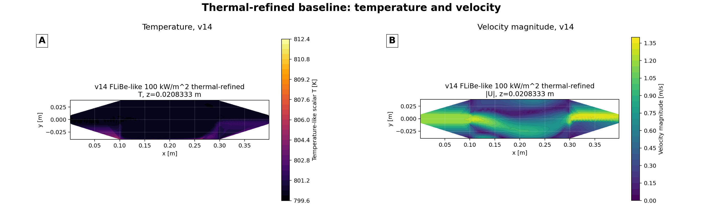

Caption: Temperature and velocity slice views for the thermal-refined FLiBe-like passive scalar baseline at 100 kW/m^2. The flow field comes from the steady Re = 10,000 RANS case and is reused for passive scalar heat transport. The figure shows the current baseline visualization workflow; it is not a validation result.

### 5.2 Mesh Sensitivity

The mesh-sensitivity study showed that the coarse mesh substantially overpredicted wall temperature.

| Quantity | Coarse v9 | Refined v12 | Thermal-Refined v14 |
|---|---:|---:|---:|
| pressure drop | about 1860 Pa | about 1858 Pa | about 1774 Pa |
| outlet average T | 800.123 K | 800.195 K | 800.200 K |
| heated-wall average T | 1084.43 K | 869.171 K | 843.798 K |
| heated-wall max T | 1119.34 K | 893.437 K | 863.519 K |
| wall average T - Tin | 284.43 K | 69.17 K | 43.80 K |

The key result is not that the wall temperature is final. The key result is that near-wall thermal resolution strongly affects the passive wall-temperature prediction.

Recommended figures:

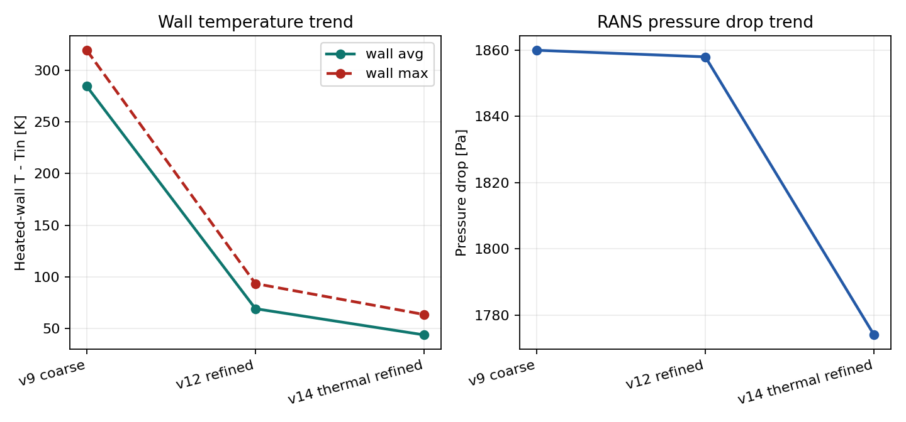

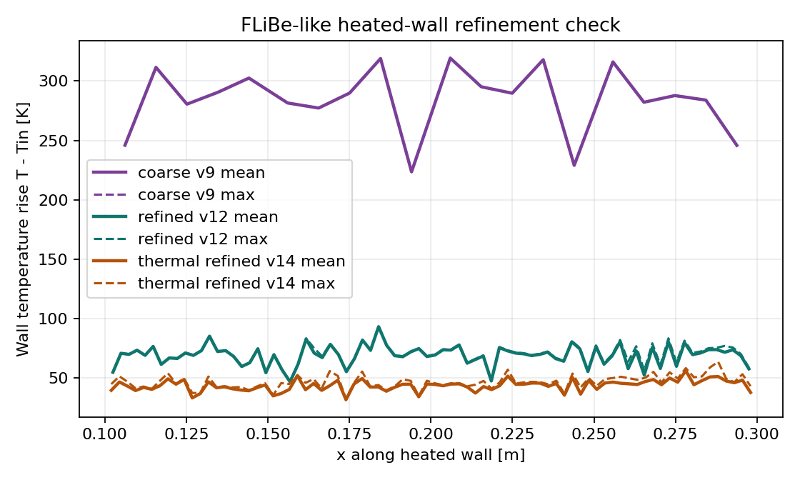

### 5.3 Passive Long-Run Check

The thermal-refined 100 kW/m^2 case was continued from 2.0 s to 4.8 s. The outlet average temperature changed from about 800.200 K to 800.213 K, and the heated-wall average temperature remained about 843.8 K. This suggests that another passive scalar long run is less valuable than targeted refinement, literature intake, or a better-defined unsteady comparison.

### 5.4 Heat-Flux Sensitivity

The 500 kW/m^2 case remained stable on the same thermal-refined mesh and frozen RANS flow field.

| Quantity | v14, 100 kW/m^2 | v16, 500 kW/m^2 |
|---|---:|---:|
| outlet average T | 800.200 K | 801.022 K |
| outlet average T - Tin | 0.200 K | 1.022 K |
| wall surface average T | 843.798 K | 1018.888 K |
| wall surface average T - Tin | 43.798 K | 218.888 K |
| wall surface max T | 863.519 K | 1116.608 K |
| wall surface max T - Tin | 63.519 K | 316.608 K |

The passive thermal response is close to linear over this heat-flux bracket. A five-times heat-flux increase produced approximately five-times larger outlet, wall-average, wall-maximum, and line-profile temperature rises.

Recommended figures:

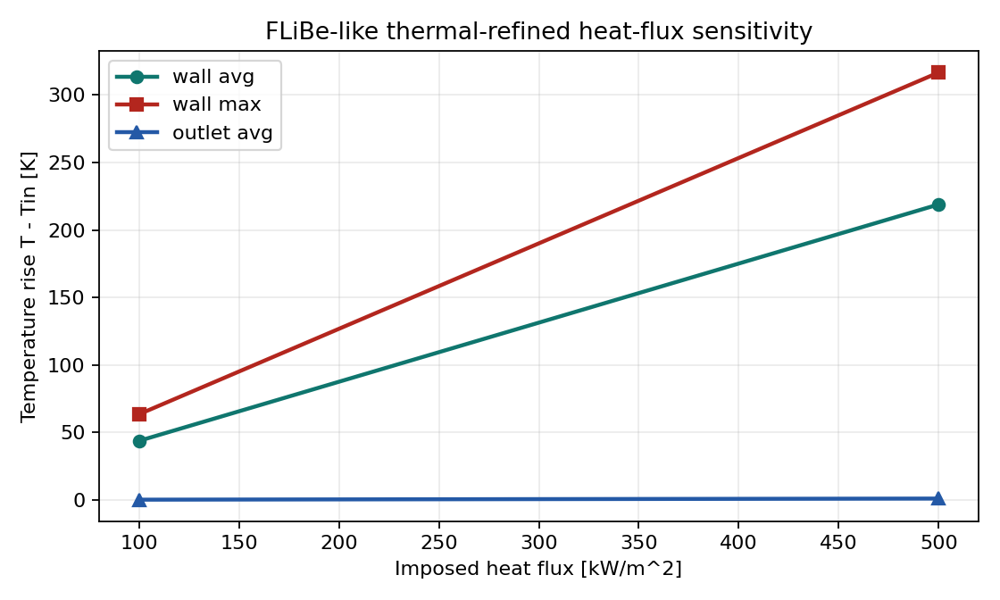

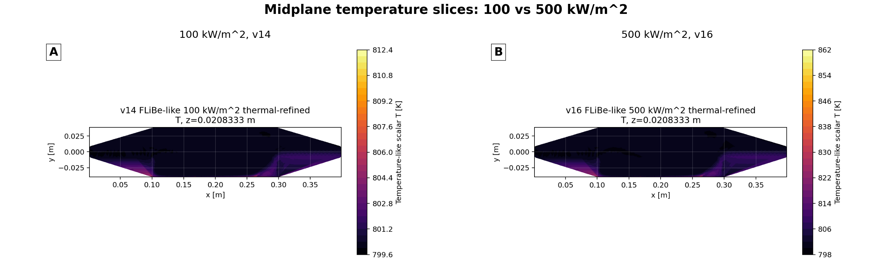

### 5.5 Diagnostic Apparent Heat-Transfer Metrics

A first diagnostic apparent heat-transfer calculation was added to support future Nusselt-number and heat-transfer-coefficient reporting.

| Case | Apparent h | Apparent Nu | Dittus-Boelter Reference Nu |
|---|---:|---:|---:|
| v14, 100 kW/m^2 | about 2.28 kW/m^2/K | about 60.9 | about 105.9 |
| v16, 500 kW/m^2 | about 2.28 kW/m^2/K | about 60.9 | about 105.9 |

This is an internal consistency check only. The current expansion/chamber geometry is not a developed straight pipe, so this should not be presented as validation against Dittus-Boelter.

### 5.6 Unsteady RANS, LES, And Thermal LES Branch

The first straight unsteady RANS branch has run to about 0.1 s with max Courant number below about 0.5. The pressure drop at 0.1 s is about 1777 Pa, close to the steady v13 pressure-drop estimate of about 1774 Pa.

The outlet-offset bent geometry was also tested with URANS as v25 to 0.4 s from the converged v22 field. The recirculation structure remained present, but probe fluctuations were very small and pressure-drop oscillation was less than 0.1%. URANS therefore supports the steady recirculation structure but does not show meaningful time dependence on either tested geometry.

The same bent geometry was then tested as v26, a first coarse wall-modeled LES smoke test using WALE. In the developed window after 0.5 s, the downstream recirculation probe near the v23 hotspot streamwise location had LES residual standard deviation about 0.054 m/s, compared with about 0.0004 m/s for URANS, with LES peak-to-peak about 0.29 m/s. This suggests the recirculation/hotspot region is dynamically active in LES while URANS averages it steady.

The same branch was extended in v27 as a first coarse thermal LES case at 100 kW/m^2. The downstream/hotspot-region fluid probe about 1 mm off the wall had detrended temperature fluctuation standard deviation about 0.234 K and peak-to-peak variation about 1.49 K. Resolved-field post-processing showed mean resolved TKE about 0.0594 m^2/s^2 in the hotspot zone and about 0.0727 m^2/s^2 in the downstream hotspot band, while the inlet duct was effectively zero. This supports a near-wall fluid thermal-fluctuation observation, not a validated wall-surface temperature prediction.

Recommended figure:

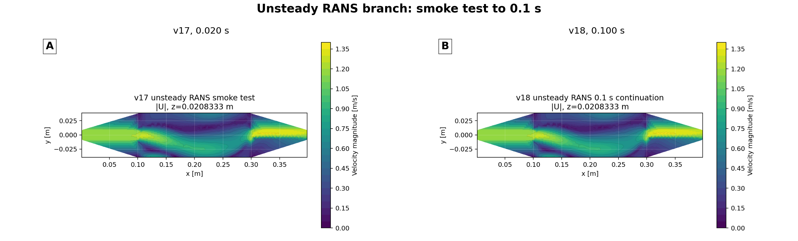

Caption: Velocity slice comparison for the first straight unsteady RANS branch. The transient case remains stable through about 0.1 s and retains a pressure drop close to the steady v13 baseline. A later bent URANS check reached 0.4 s and also remained close to its steady baseline. This is a working unsteady RANS result, not an LES result.

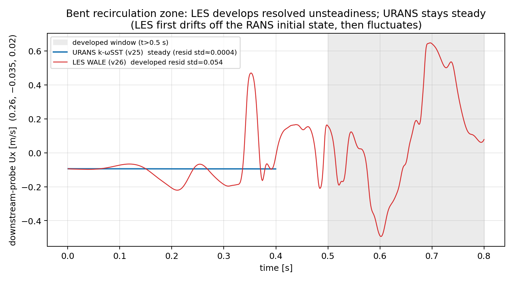

Caption: First coarse, wall-modeled LES smoke test on the outlet-offset geometry compared with the bent URANS probe signal. The downstream recirculation probe near the v23 hotspot region shows LES velocity fluctuations far larger than the URANS residual. This is illustrative only; it is not wall-resolved, grid-converged, statistically converged, thermally coupled, or validated.

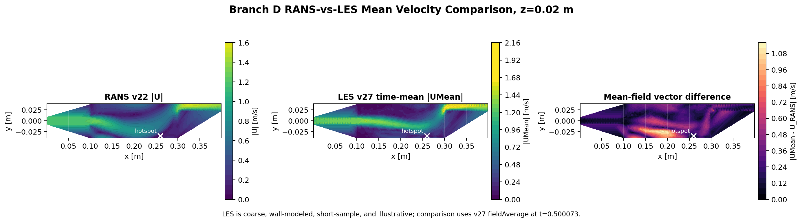

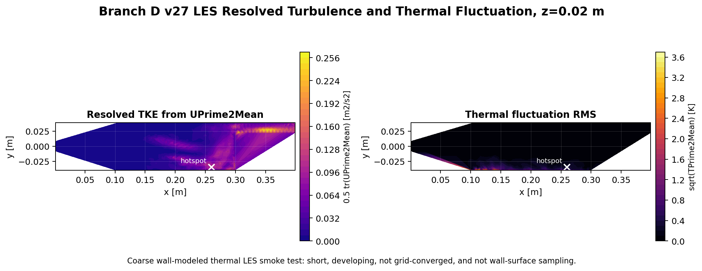

Caption: v27 coarse thermal LES diagnostics for the outlet-offset geometry. The mean-field comparison shows where the short-sample LES mean departs from steady RANS in the chamber and near-wall recirculation region. The resolved-TKE and temperature-fluctuation figure shows turbulence and near-wall fluid thermal fluctuation intensity concentrated in the recirculation/hotspot-side region. The case is coarse, wall-modeled, short, thermally developing, not wall-resolved, not grid-converged, and not validated.

### 5.7 Branch D Recirculation Geometry

Branch D tested whether a controlled geometry change could strengthen the recirculation/low-flow region near the heated wall and change the passive thermal response. The branch used an outlet-offset geometry while holding coolant, Reynolds number, heated-wall area, heat flux, and mesh resolution comparable to the straight v13/v14 baseline.

| Metric | Straight Baseline | Offset Branch D |
|---|---:|---:|
| pressure drop | about 1774 Pa | about 1983 Pa |
| near-wall reverse-flow fraction | 0.363 | 0.462 |
| near-wall mean Ux | 0.177 m/s | 0.087 m/s |
| wall-average T - Tin | 43.80 K | 44.16 K |
| wall-peak T - Tin | 63.52 K | 77.00 K |
| mass-weighted outlet T - Tin | 0.169 K | 0.156 K |

The outlet-offset geometry strengthened the low-flow region and increased the same-mesh local peak wall-temperature diagnostic by about 21%, while the average wall-temperature rise changed by `+0.82%` (`43.80 K` to `44.16 K`). This supports the recirculation-hotspot story as a same-mesh distribution result: geometry can redistribute heat into a local peak even when the average wall response and bulk outlet temperature remain similar. Later GCI work shows the single-cell peak is mesh-sensitive, so it should not be presented as grid-converged.

The same comparison was extended to the 500 kW/m^2 heat-flux case. Average wall-temperature rise remained nearly geometry-insensitive, but the peak penalty scaled with heat load: the offset-straight peak gap increased from about +13.5 K at 100 kW/m^2 to about +68.6 K at 500 kW/m^2.

We added v28/v29 as a third Branch D geometry: a real 90-degree bend with 72,912 cells and the same 3,216 heated-wall faces. The bend did not create the strongest hotspot. Its peak wall dT was 59.9 K, below the straight baseline 63.52 K and the outlet-offset 77.00 K. The bend is therefore the discriminating case: a bend and local separation are not sufficient to create the largest hotspot if the near-wall flow reattaches and flushing remains comparatively high.

| Geometry | Near-wall mean speed | Peak wall dT |
|---|---:|---:|
| 90-degree bend | 0.86 m/s | 59.9 K |
| straight baseline | 0.47 m/s | 63.52 K |
| outlet-offset | 0.39 m/s | 77.00 K |
| backward-facing step | 0.296 m/s | 77.4 K |

This supports the report-safe Branch D headline:

> Across the four tested geometries, same-mesh peak wall dT increases as near-wall flushing speed decreases (`r = -0.85`, `n = 4`). The backward-facing step confirms the slow-flow / hot-peak prediction, while the slow end appears to saturate near `77 K` in this passive-scalar setup. This is an illustrative, mesh-sensitive trend, not a validated or grid-converged heat-transfer correlation.

Recommended figures:

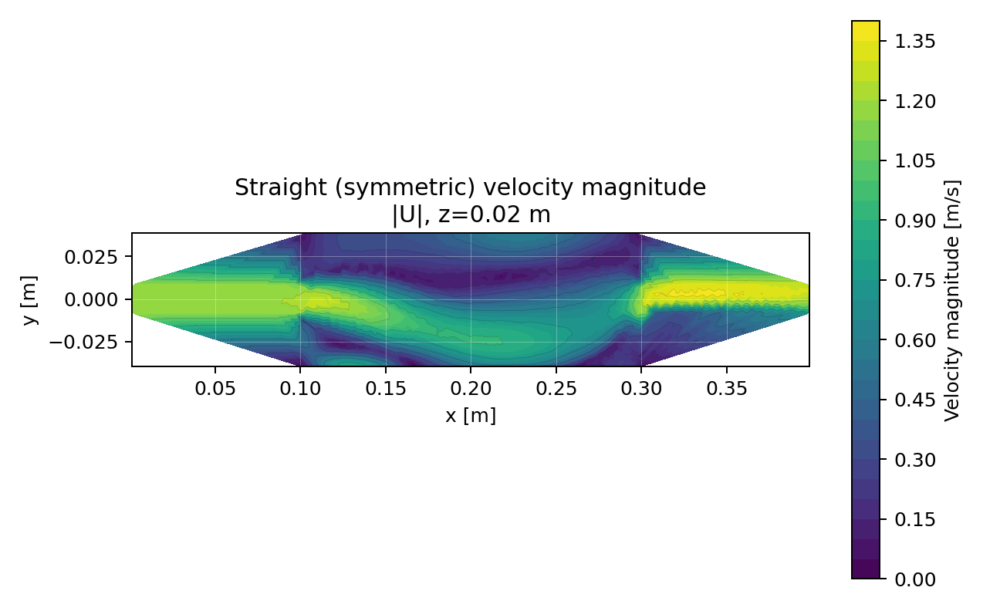

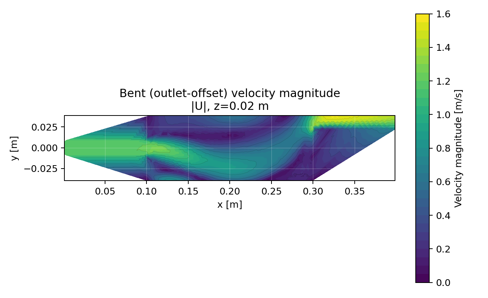

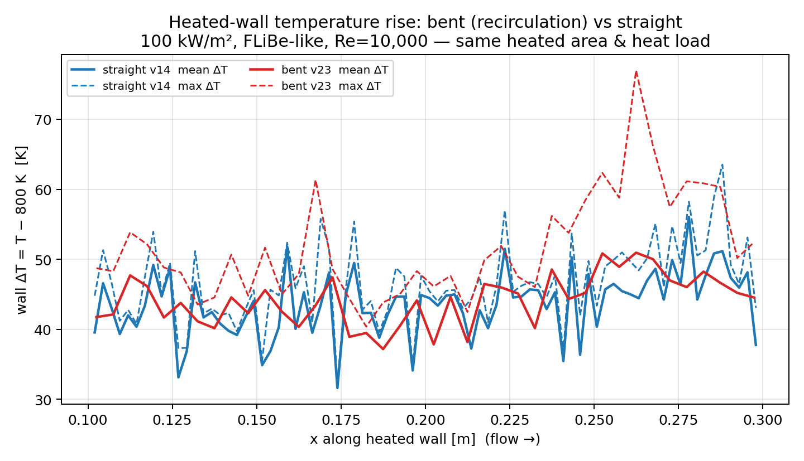

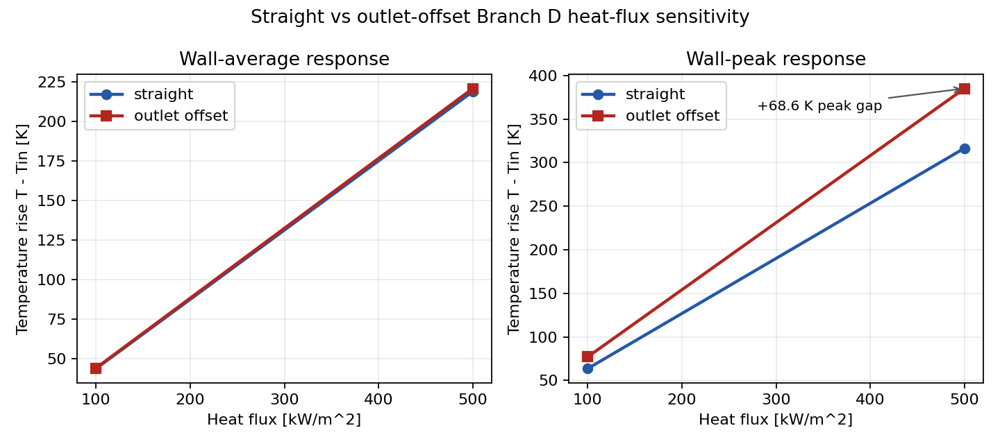

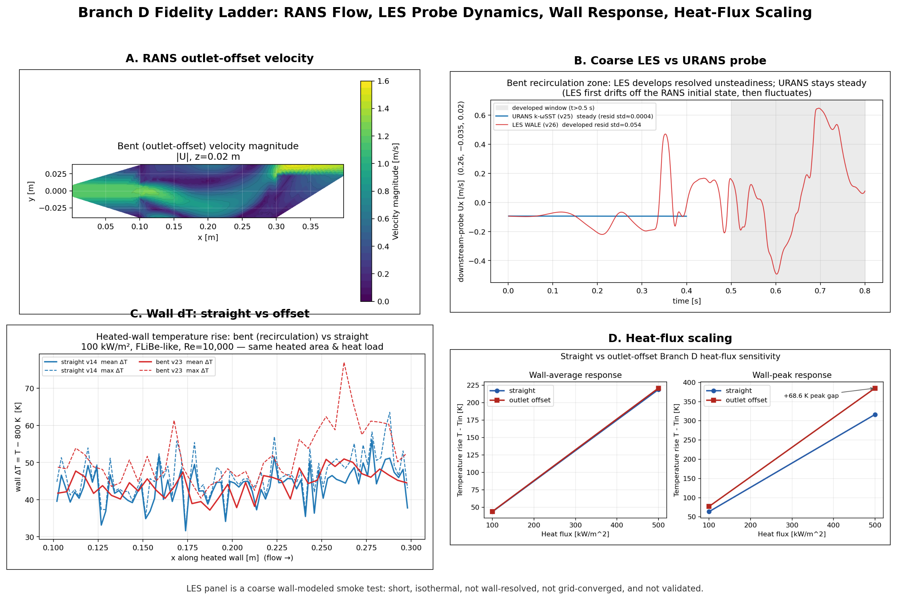

Caption: Four-panel Branch D fidelity ladder connecting the RANS velocity field, coarse LES-vs-URANS probe dynamics, wall-temperature peak penalty, and heat-flux scaling result. The LES component is a coarse, wall-modeled, short, isothermal smoke test and should not be described as wall-resolved, grid-converged, or validated.

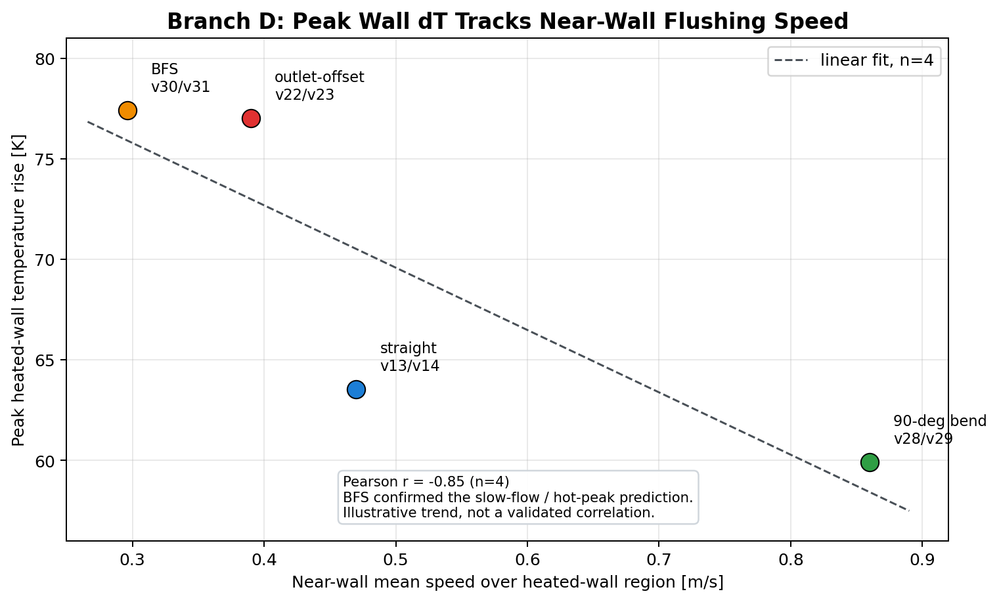

Caption: Branch D near-wall flushing-speed trend across the 90-degree bend, straight baseline, outlet-offset, and backward-facing-step geometries. Lower near-wall mean speed corresponds to higher same-mesh peak wall-temperature rise (`r = -0.85`, `n = 4`). The BFS point confirms the slow-flow / hot-peak prediction. This figure is an illustrative four-geometry trend, not a validated or grid-converged correlation.

### 5.8 Wall-Resolved CHT And P4 Geometry Mechanism

The passive scalar Branch D sequence identifies where hotspots appear, but the physical wall-temperature scale comes from wall-resolved CHT. The trusted straight-channel CHT bridge gives mean interface superheats of `28.16 K` and `27.21 K` on two wall-resolved meshes, only `3.4%` apart. Dittus-Boelter and Gnielinski film-temperature estimates are `25.17 K` and `25.71 K`, so the wall-resolved CHT values agree within about `6-10%`. This anchors the physical scale for the simplified module.

The P4 geometry CHT table then extends the mechanism comparison to straight, BFS, and outlet-offset geometries:

| Geometry | Mean interface dT | Peak interface dT | Interpretation |
|---|---:|---:|---|
| straight | `28.16 K` | `34.41 K` | straight reference / bridge anchor |
| BFS | `31.45 K` | `45.71 K` | clearest slow-flushing local hotspot |
| outlet-offset | `26.40 K` | `32.77 K` | lower local peak in final CHT table |

The robust conclusion is local: peak wall temperature follows local near-wall flushing over the heated surface. BFS is hottest because slow fluid sits over the heated floor. Outlet-offset is not worst in the final CHT table because its dead-zone geometry does not place the poorest flushing over the heated surface in the same way. The caveat is that heated lengths and geometries differ, so the P4 table should not be sold as a raw mean-temperature design ranking.

Recommended figures:

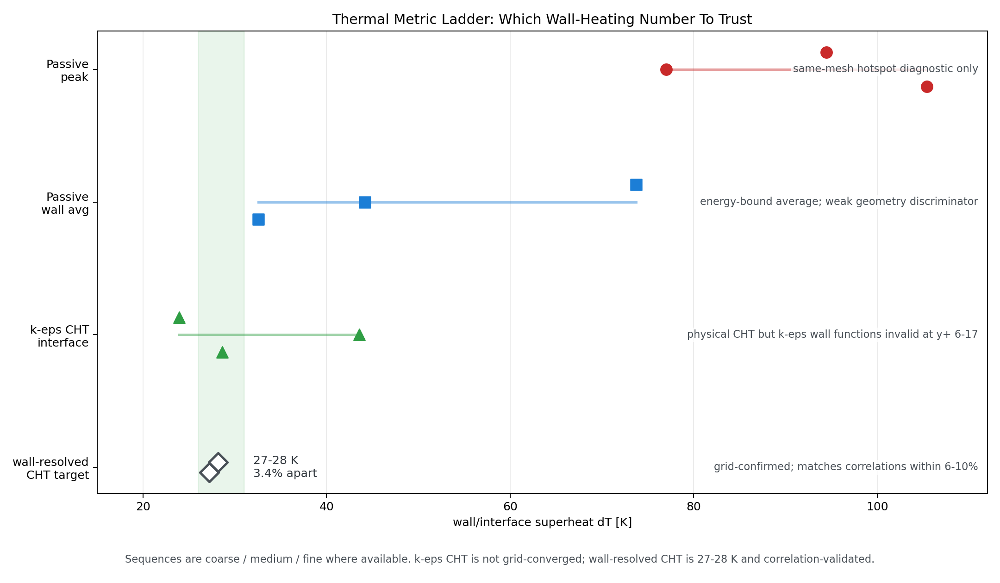

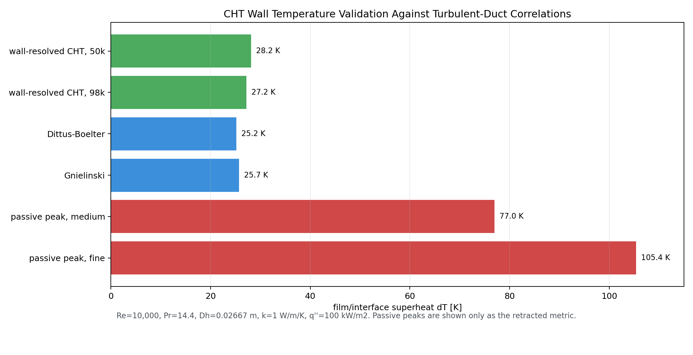

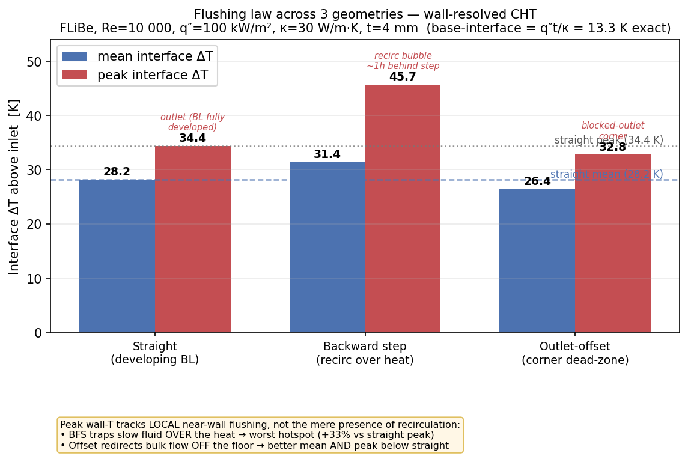

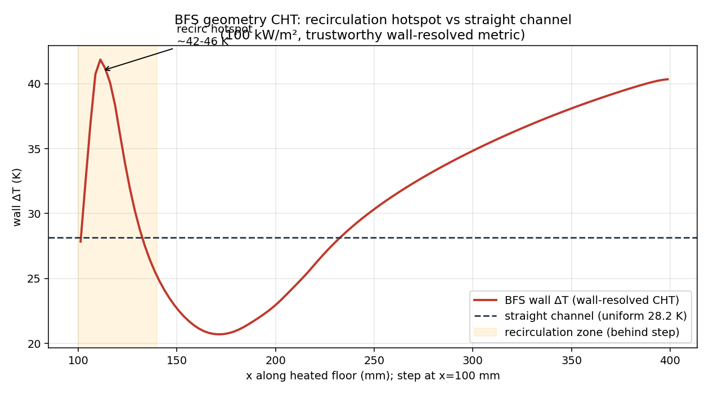

### 5.9 CHT Velocity Law, Pumping Tradeoff, And LES Harness

The wall-resolved CHT velocity sweep gives the current quantitative heat-transfer law for the straight bridge. Across `Re = 5,000-20,000`, interface superheat decreases from `45.25 K` to `17.03 K`. A log-log fit gives `dT ~ U^-0.7047` with `R2 = 0.99969`, while `Nu_CHT ~ Re^0.7047`. This is a straight-channel bridge law, not a geometry-specific optimization law.

The pumping-power tradeoff converts that law into design language. At `100 kW/m^2`, increasing from `Re = 10,000` to `Re = 20,000` lowers interface superheat from `28.16 K` to `17.03 K`, but raises simplified-module hydraulic pumping power from about `1.65 W` to `11.47 W`. The AQ/AW design-nomogram work shows that a strict `873 K`, `250 kW/m^2` solid-base target becomes borderline: the fitted `-0.7047` exponent shifts the required Reynolds number to about `22,572`, above the current `Re <= 20,000` envelope.

The local LES channel shakedown supports the HPC-1 path. The `les_channel_wm` case ran cleanly with `65,536` cells, measured `Re_tau = 192`, used the nearest MKM benchmark `Re_tau = 180`, and had first-cell `y+ = 0.67`. Pressure-gradient and wall-gradient estimates of `u_tau` agreed within about `0.5%`, and the viscous sublayer followed `U+ = y+`. The log-region/centerline `U+` overshot by about `22%`, so the first run proved the harness but exposed under-resolution. The refined O benchmark then moved the `u'+` peak from `3.26` to `2.80`, inside the MKM `2.6-2.8` band, improved mean log-law error from `30.7%` to `10.2%`, and kept `u_tau` consistency at `0.98`. This certifies the benchmark harness and resolution direction; it is still not the HPC-1 heated-channel result.

Recommended figures:

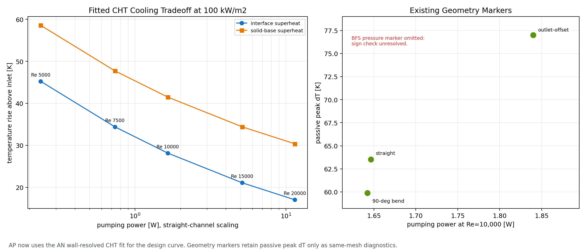

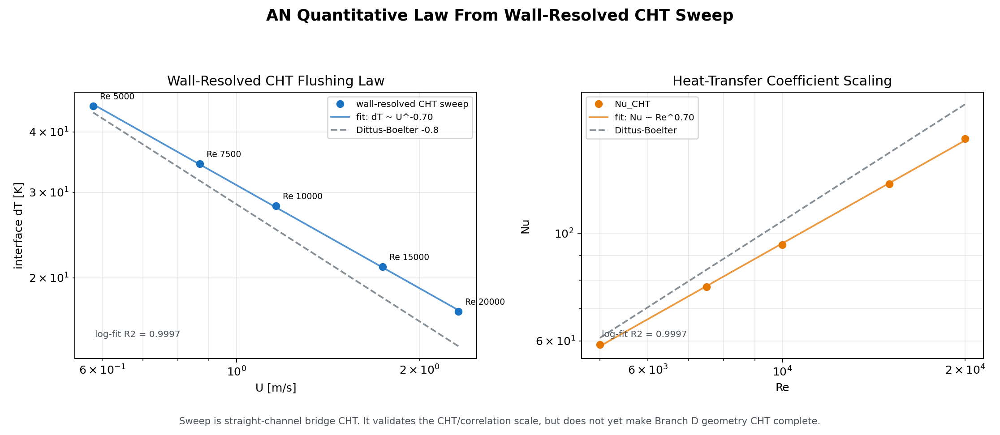

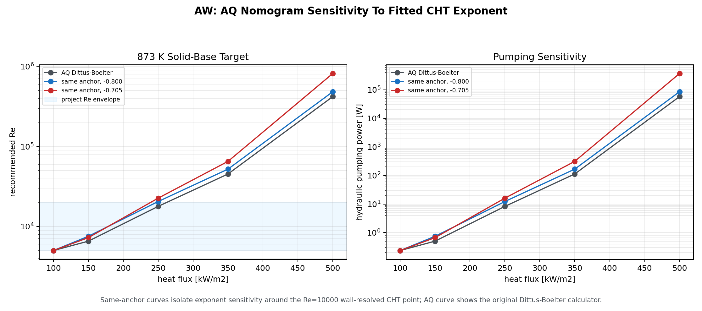

Required promoted backup figure:

- `cases/branch_d/figs/m_les_wall_profile.png`: local LES `U+` profile; promote into `results/report_figures/` if the LES harness is discussed in slides.

## 6. Limitations

The consolidated limitations source for this draft is `docs/uncertainty_and_limitations_chapter.md`. The most important limitation is that the outlet-offset single-cell peak wall-temperature metric did not pass a monotonic grid-convergence check:

| Mesh | Cells | Wall-average dT | Peak wall dT |
|---|---:|---:|---:|
| coarse | 21,248 | 73.74 K | 94.43 K |
| medium / v23 | 73,128 | 44.16 K | 77.00 K |
| fine | 218,080 | 32.58 K | 105.38 K |

Because the peak sequence is non-monotonic, peak wall `dT` should be treated as a same-mesh hotspot diagnostic, not as a grid-converged wall-temperature prediction. Wall-average and nondimensional average metrics are more stable, while the velocity-side near-wall flushing evidence carries the main mechanistic weight.

The current model also excludes:

- full stellarator blanket CAD
- buoyancy
- temperature-dependent density and heat capacity; A3 includes only `mu(T)` and `k(T)`
- broad same-speed/same-Re property operating-point sweep beyond the matched A3 comparison
- full blanket-scale or matched-heated-length CHT optimization across the Branch D geometries
- volumetric nuclear heating
- MHD
- MHD-coupled CFD or stellarator magnetic-field mapping
- tritium transport
- neutronics
- structural mechanics
- material corrosion/redox/irradiation behavior
- physical validation against experiment
- validated heat-transfer correlation from the four-point flushing-speed trend
- wall-resolved or grid-converged LES
- validated or wall-surface thermal LES
- blanket-scale CHT-across-geometries prediction

The current work is credible because these exclusions are stated clearly and tied to future-work sources. It would become weak if the report implied reactor-level blanket performance from the simplified passive-scalar cases.

The CHT, P4, velocity-sweep, pumping-tradeoff, and LES-harness results are reported in Sections 5.8-5.9. Their limitations are:

- The trusted `28.16/27.21 K` CHT bridge values are straight-channel simplified-module results, not blanket validation.
- The P4 geometry CHT table supports a local-flushing mechanism claim, not a raw mean-temperature geometry ranking, because heated lengths/geometries differ.
- The CHT velocity law applies to the straight bridge over `Re = 5,000-20,000`; values outside that envelope are extrapolations or design prompts.
- The pumping-power result is hydraulic `dP*Q`; it does not include pump efficiency, manifolds, or plant balance.
- The `500 kW/m^2` wall-resolved CHT bridge is a material-limit warning case, with interface `940.80 K` and solid-base `1007.47 K`.
- The local `les_channel_wm` first pass proved the harness but failed the production-quality profile gate; the refined O pass fixes much of that benchmark-profile issue, but HPC-1 must still reproduce the quality with heat transfer and longer averaging.

## 7. Future Work

The next computational path should be chosen based on advisor feedback on Branch D.

If the final claim emphasizes wall-temperature credibility, the next step is not more URANS; it is either a stricter apples-to-apples CHT rerun requested by the advisor or the HPC-1 LES path. The current P4 geometry CHT comparison is already closed for mechanism: straight/BFS/outlet-offset mean and peak interface dT are in `docs/geometry_cht_comparison_template_av.md`. If the final claim emphasizes workflow and model hierarchy, the next step is a refined/longer LES rather than another short URANS continuation, with wall-surface thermal sampling if thermal LES is central. If the final claim shifts toward heat-transfer metrics, the next step is a simpler channel or enhanced-channel geometry where Nusselt number, friction factor, pressure drop, and heat-transfer coefficient can be compared more meaningfully with literature.

The larger future-work stack would include temperature-dependent density/heat capacity and solid material cards beyond A3, a broader same-speed/same-Re property sweep, matched-heated-length and blanket-scale CHT, volumetric nuclear heating, neutronics, MHD benchmark and Branch D scoping runs, tritium transport, corrosion/material compatibility, and thermal-structural coupling.

The validity envelope is summarized in `docs/validity_envelope_ar.md`. In short, the current CHT law and AP/AQ tools should be kept inside the simplified, smooth, constant-property FLiBe-like module envelope over `Re = 5,000-20,000`. They should not be extrapolated to transitional flow, strong property variation, MHD-coupled flow, rough or actual stellarator CAD walls, volumetric nuclear heating, tritium/neutronics, or full blanket performance.

## 8. Conclusion

This project has produced a defensible simplified CFD baseline. It demonstrates a reproducible geometry/mesh/OpenFOAM workflow, a FLiBe-like RANS flow case, passive thermal cases, mesh sensitivity, heat-flux sensitivity, diagnostic heat-transfer metrics, slice visualization, straight/bent unsteady RANS checks, a controlled four-geometry near-wall flushing comparison, wall-resolved CHT bridge and P4 mechanism results, and caveated LES shakedowns.

The strongest current claim is:

> In this simplified stellarator-relevant coolant module, local near-wall flushing over the heated surface governs hotspot behavior. Passive Branch D results identify the mechanism, while wall-resolved CHT supplies the physical wall-temperature scale and the P4 straight/BFS/outlet-offset table confirms the local-flushing hotspot pattern.

The HPC-1 production wall-resolved LES remains the capstone objective. The local channel LES/harness result now certifies the benchmark direction after the refined O pass, but it should still be treated as readiness evidence rather than a completed heated-channel high-fidelity answer.

The project should not claim:

> The simulation predicts stellarator blanket performance.

## Appendix A. Report Assembly Sources

This draft is the canonical integrated report file. The items below are source fragments, supporting tables, and planning documents used to assemble it; they should not be treated as competing report drafts.

- `docs/report_abstract_intro_draft.md`
- `docs/report_literature_review_draft.md`
- `docs/report_methods_results_draft.md`
- `docs/report_figure_table_map.md`
- `docs/report_claim_evidence_table.md`
- `docs/uncertainty_and_limitations_chapter.md`
- `docs/branch_d_conjugate_heat_transfer_plan.md`
- `docs/cht_correlation_validation_an.md`
- `docs/geometry_cht_comparison_template_av.md`
- `docs/cht_velocity_sweep_ap.md`
- `docs/pumping_power_tradeoff_ao.md`
- `docs/design_nomogram_aq.md`
- `docs/les_hpc_readiness_plan_o.md`
- `docs/flibe_property_realism_sensitivity_plan.md`
- `docs/mhd_scoping_hartmann_estimate.md`
- `docs/final_report_assembly_checklist.md`
- `docs/report_references_draft.md`
- `references/report_literature_priority_map.md`
